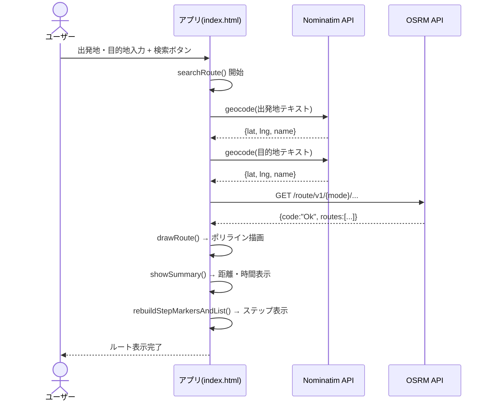
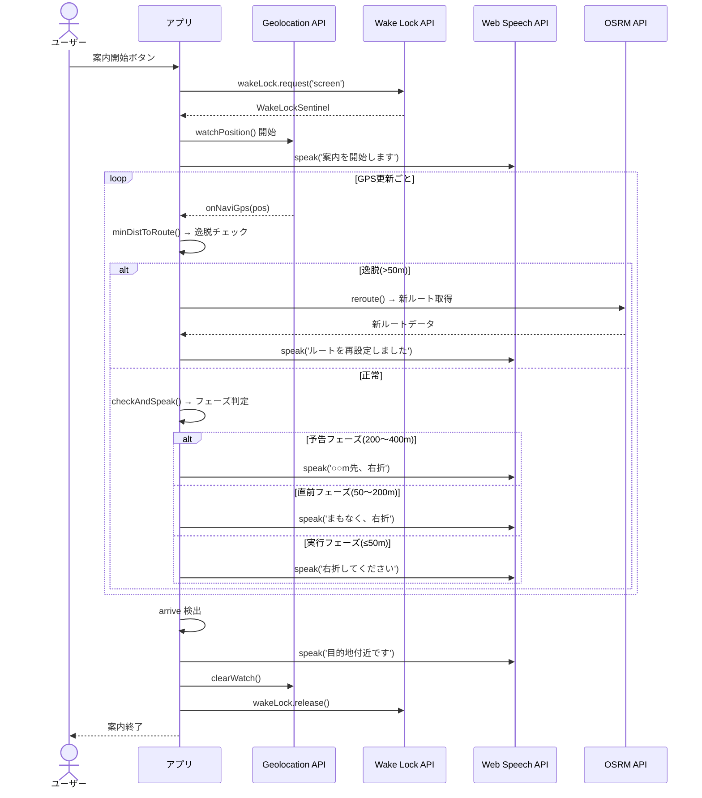
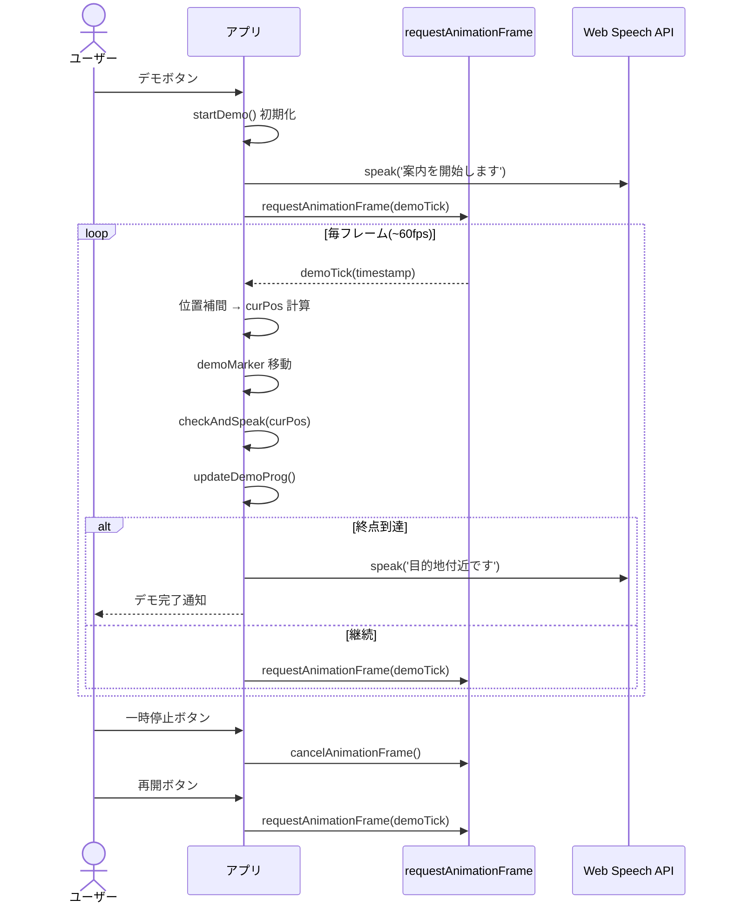
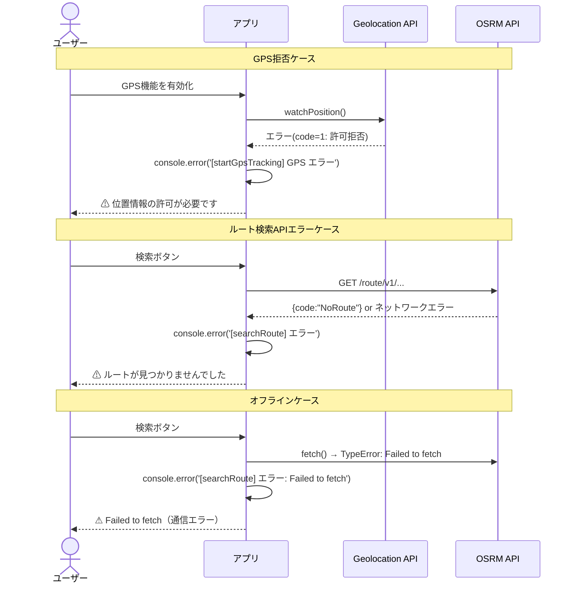

# RouteMap 設計書

**バージョン:** 1.0  
**作成日:** 2026-04-02  
**対象ファイル:** index.html

---

## 1. システム概要

RouteMap はクライアントサイドのみで動作するシングルページアプリケーション（SPA）である。  
サーバーサイド処理は一切持たず、静的ファイルとして配信可能。  
全ての HTML / CSS / JavaScript を `index.html` 1ファイルに収録する。

```
[ブラウザ]
  ├── HTML/CSS/JS (index.html)
  ├── Leaflet.js (CDN)
  ├── OSMタイル (tile.openstreetmap.org)
  ├── OSRM API (routing.openstreetmap.de)
  ├── Nominatim API (nominatim.openstreetmap.org)
  └── ブラウザAPI (Geolocation / Web Speech / Wake Lock)
```

---

## 2. 技術スタック・外部ライブラリ

| 種別 | 名称 | バージョン | 用途 |
|------|------|-----------|------|
| 地図ライブラリ | Leaflet.js | **1.9.4** | 地図表示・マーカー・ポリライン |
| フォント | Google Fonts / Space Mono | 400, 700 | 等幅フォント（ロゴ・ログ等） |
| フォント | Google Fonts / Noto Sans JP | 300, 400, 600 | 日本語フォント |
| タイル | OpenStreetMap | — | 地図タイル配信 |
| ルーティング | OSRM (routing.openstreetmap.de) | — | ルート計算 |
| ジオコーディング | Nominatim (nominatim.openstreetmap.org) | — | 住所→座標 / 座標→住所 |
| 音声合成 | Web Speech API (SpeechSynthesis) | ブラウザ標準 | 日本語 TTS |
| 位置情報 | Geolocation API | ブラウザ標準 | GPS 現在地取得 |
| 画面点灯維持 | Screen Wake Lock API | ブラウザ標準 | 案内中の画面消灯防止 |

---

## 3. ファイル構成

```
routemap/
├── index.html          # アプリ本体（HTML / CSS / JS を全て含む）
├── CLAUDE.md           # 開発規約・フロー定義
└── docs/
    ├── 要件定義書.md    # 機能・非機能要件
    └── 設計書.md       # 本ドキュメント
```

---

## 4. HTML 構造

```
<html>
├── <head>
│   ├── Google Fonts (Space Mono, Noto Sans JP)
│   ├── Leaflet CSS (CDN)
│   └── <style> … CSS全体 …
│
└── <body>
    └── #app（flexbox 縦積み）
        ├── #topbar（モバイル用ロゴバー）
        ├── #tabbar（NAVI / MAP / LOG タブ）
        ├── #views（コンテンツエリア）
        │   ├── #view-navi（スクロール可能な操作パネル）
        │   │   ├── GPS チェックボックス行
        │   │   ├── 出発地・目的地 入力フォーム
        │   │   ├── 移動手段セレクター（自動車・自転車・徒歩）
        │   │   ├── 検索・クリアボタン
        │   │   ├── ステータスバー
        │   │   ├── ルートサマリーカード
        │   │   ├── 案内バナー（#navi-bar）
        │   │   ├── デモ操作バー（#demo-bar）
        │   │   └── ステップ一覧（#steps-list）
        │   ├── #view-map（地図フルスクリーン）
        │   │   ├── #leaflet-map
        │   │   ├── #map-navi-overlay（案内オーバーレイカード）
        │   │   ├── #hint-box（操作ヒント）
        │   │   └── FABボタン（ズーム・センタリング）
        │   └── #view-log（ログビューア）
        │       ├── ログヘッダー（件数・クリアボタン）
        │       ├── サブタブ（構造化 / Raw JSON / 全ログ）
        │       └── ログペイン（折りたたみエントリー）
        │
        ├── Leaflet JS (CDN)
        └── <script> … JavaScript全体 …
```

---

## 5. CSS 設計

### 5.1 CSS 変数（カラーパレット）

```css
:root {
  --bg:      #0d0f14   /* 背景（最暗） */
  --panel:   #151820   /* パネル背景 */
  --border:  #252a35   /* ボーダー */
  --accent:  #00e5a0   /* アクセント（緑） */
  --warn:    #ff6b35   /* 警告（オレンジ） */
  --demo:    #f5c518   /* デモ（ゴールド） */
  --nav:     #a78bfa   /* 案内中（紫） */
  --text:    #e8eaf0   /* テキスト */
  --muted:   #6b7280   /* ミュートテキスト */
  --tabh:    50px      /* タブバー高さ */
  --topbar:  48px      /* トップバー高さ */
}
```

### 5.2 レイアウト

| ブレークポイント | レイアウト |
|----------------|-----------|
| `< 900px`（モバイル） | 縦積み + タブ切り替え（NAVI / MAP / LOG） |
| `≥ 900px`（デスクトップ） | 3カラム横並び（NAVI 320px固定 / MAP 可変 / LOG 280px固定） |

---

## 6. JavaScript モジュール構成

JavaScript は 1 つの `<script>` タグ内に収め、セクションコメント（`// ════ 名前 ════`）で区切る。

| セクション | 主な処理 |
|-----------|---------|
| タブ切り替え | クリックイベントでビュー表示切り替え |
| 地図初期化 | Leaflet マップ生成、OSM タイル追加 |
| 状態変数 | グローバル変数定義 |
| アイコン定義 | DivIcon マーカー生成 |
| 音声合成ユーティリティ | `speak()` |
| 音声テキスト生成 | `makeVoiceText()` / `maneuverArrow()` / `maneuverLabel()` |
| ジオコーディング | `geocode()` / `revGeo()` |
| マーカーセット | `setStart()` / `setEnd()` / `updateHint()` |
| 地図クリック | タップ → マーカー配置イベント |
| ステータス | `showStatus()` / `hideStatus()` |
| ルート検索 | `searchRoute()` |
| ルート描画 | `drawRoute()` |
| ステップマーカー・一覧 | `rebuildStepMarkersAndList()` |
| 概要表示 | `showSummary()` |
| 音声案内エンジン | `startNavi()` / `onNaviGps()` / `checkAndSpeak()` / `reroute()` / `stopNavi()` 他 |
| デモ走行 | `startDemo()` / `demoTick()` / `pauseDemo()` / `resumeDemo()` / `stopDemo()` |
| GPS追跡（通常） | `startGpsTracking()` / `updateGpsMarker()` |
| ロガー | `logRequest()` / `logRouteResponse()` / `logVoice()` / `logError()` 他 |
| GPS・入力イベント | ボタン・チェックボックス・キー入力ハンドラ |

---

## 7. 状態変数一覧

| 変数名 | 型 | 初期値 | 説明 |
|--------|-----|--------|------|
| `startLatLng` | `{lat,lng}` \| null | null | 出発地座標 |
| `endLatLng` | `{lat,lng}` \| null | null | 目的地座標 |
| `startMarker` | Leaflet Marker \| null | null | 出発地マーカー |
| `endMarker` | Leaflet Marker \| null | null | 目的地マーカー |
| `routeLayer` | Leaflet LayerGroup \| null | null | ルートポリライン |
| `selectedMode` | string | `'driving'` | 移動手段 |
| `gpsMarker` | Leaflet Marker \| null | null | GPS自車マーカー |
| `gpsAccCircle` | Leaflet Circle \| null | null | GPS精度円 |
| `watchId` | number \| null | null | GPS watchPosition ID（通常） |
| `isTracking` | boolean | false | GPS追跡中フラグ |
| `gpsLatLng` | `{lat,lng}` \| null | null | 最新GPS座標 |
| `useGpsAsStart` | boolean | false | GPS出発地モード |
| `demoCoords` | `[lat,lng][]` | `[]` | ルート座標配列 |
| `demoIdx` | number | 0 | デモ走行位置インデックス |
| `demoRafId` | number \| null | null | requestAnimationFrame ID |
| `demoPaused` | boolean | true | デモ一時停止フラグ |
| `demoSpeed` | number | 1 | 速度倍率（0.5〜16） |
| `demoMarker` | Leaflet Marker \| null | null | デモ自車マーカー |
| `demoTrail` | Leaflet Polyline \| null | null | デモ走行軌跡 |
| `stepMarkers` | Leaflet Marker[] | `[]` | ステップ番号マーカー |
| `logCount` | number | 0 | ログ件数カウンター |
| `naviActive` | boolean | false | 案内中フラグ |
| `naviSteps` | Array | `[]` | OSRM ステップ配列 |
| `naviMuted` | boolean | false | ミュートフラグ |
| `naviSpoken` | Object | `{}` | 発話済みフェーズ管理 |
| `naviWatchId` | number \| null | null | GPS watchPosition ID（案内用） |
| `naviCurrentStepIdx` | number | 0 | 現在案内ステップインデックス |
| `lastRerouteTime` | number | 0 | 最終リルート時刻（ms） |
| `wakeLock` | WakeLockSentinel \| null | null | Wake Lock オブジェクト |
| `naviApproaching` | boolean | false | ステップ接近フラグ |
| `naviPrevDist` | number | Infinity | 前フレームのステップ距離（m） |
| `APPROACH_THR` | 30 (const) | — | 接近監視開始距離（m） |
| `FALLBACK_THR` | 60 (const) | — | 強制通過距離（m） |
| `demoMilestone25/50/75` | boolean | false | デモ進捗マイルストーンフラグ |

---

## 8. データフロー

### 8.1 ルート検索フロー

```
ユーザー入力（テキスト or 地図タップ）
  ↓
searchRoute()
  ├── [GPS出発地モード] → gpsLatLng を startLatLng に設定
  ├── geocode(startInput) → startLatLng
  ├── geocode(endInput)   → endLatLng
  ↓
OSRM API fetch(url)
  ├── logRequest(url)
  ├── data.routes[0] → naviSteps[], demoCoords[]
  └── logRouteResponse(data)
  ↓
drawRoute(route)  → 地図にポリライン描画
  ↓
showSummary(route)
  └── rebuildStepMarkersAndList(route)
        → steps-list DOM 更新
        → stepMarkers[] 地図追加
```

### 8.2 ナビゲーションフロー

```
startNavi()
  ├── Wake Lock 取得
  └── watchPosition() 開始
        ↓
onNaviGps(pos)
  ├── [初回] seekNearestStep(curPos) → naviCurrentStepIdx 調整
  ├── minDistToRoute(curPos)
  │     └── [> 50m] → reroute(lat, lng)
  │           ├── [クールダウン中] → return（スキップ）
  │           ├── OSRM API 再取得
  │           └── naviSteps / demoCoords 更新
  └── checkAndSpeak(curPos)
        ├── haversine(curPos, step.location) → dist
        ├── [200〜400m] → speak(prep) ※予告
        ├── [50〜200m]  → speak(soon) ※直前
        ├── [≤50m]      → speak(now)  ※実行
        ├── [通過判定]  → naviCurrentStepIdx++
        └── updateNaviBanner() / highlightNaviStep()
  ↓
[arrive検出 or stopNavi()]
  └── Wake Lock 解放 / watchPosition 停止
```

### 8.3 デモ走行フロー

```
startDemo()
  ├── naviActive = true
  ├── demoIdx = 0
  └── requestAnimationFrame(demoTick)
        ↓
demoTick(ts) ← 毎フレーム
  ├── dt = (ts - lastDemoTs) / 1000
  ├── remain = BASE_SPD(60m/s) × demoSpeed × dt
  ├── while(remain > 0) → demoIdx 進行（セグメント補間）
  ├── demoMarker.setLatLng(curPos)
  ├── updateDemoProg() → プログレスバー更新
  ├── checkAndSpeak(curPos) → 音声案内
  └── [demoIdx ≥ end] → speak('arrive') → 完了
```

---

## 9. シーケンス図

### 9.1 ルート検索シーケンス



### 9.2 ナビゲーション開始〜到着シーケンス



### 9.3 デモ走行シーケンス



### 9.4 エラー系シーケンス



---

## 10. API 連携仕様

### 10.1 OSRM ルーティング API

| 項目 | 内容 |
|------|------|
| エンドポイント | `https://routing.openstreetmap.de/{server}/route/v1/{profile}/{lng},{lat};{lng},{lat}` |
| メソッド | GET |
| パラメータ | `overview=full&geometries=geojson&steps=true` |
| サーバー/プロファイル | driving → `routed-car/driving`、cycling → `routed-bike/bike`、foot → `routed-foot/foot` |
| 正常レスポンス | `data.code === "Ok"` |
| 使用フィールド | `routes[0].distance`、`routes[0].duration`、`routes[0].geometry.coordinates`、`routes[0].legs[].steps[]` |

### 10.2 Nominatim ジオコーディング API

| 項目 | 内容 |
|------|------|
| 検索エンドポイント | `https://nominatim.openstreetmap.org/search` |
| 逆ジオエンドポイント | `https://nominatim.openstreetmap.org/reverse` |
| メソッド | GET |
| 共通パラメータ | `format=json&accept-language=ja` |
| 検索パラメータ | `q={クエリ}&limit=1` |
| 逆ジオパラメータ | `lat={緯度}&lon={経度}` |
| User-Agent | `RouteMapApp/1.0`（利用規約準拠） |

### 10.3 OpenStreetMap タイル

| 項目 | 内容 |
|------|------|
| URL テンプレート | `https://{s}.tile.openstreetmap.org/{z}/{x}/{y}.png` |
| 最大ズーム | 19 |
| 著作権表示 | `© OpenStreetMap contributors`（地図上に常時表示） |

---

## 11. エラーハンドリング方針

| ケース | ハンドリング |
|--------|------------|
| ルート検索失敗（API エラー・ネットワーク） | try/catch → `console.error` + `showStatus('error')` + `logError()` |
| ジオコーディング失敗（結果なし） | `throw new Error` → 呼び出し元 `searchRoute` の catch で処理 |
| 逆ジオコーディング失敗 | `console.error` + 座標文字列にフォールバック（機能継続） |
| GPS 拒否・タイムアウト | `console.error` + `showStatus('error')` |
| Wake Lock 取得失敗 | `console.warn` + スキップ（案内は継続） |
| 再ルート探索失敗 | `console.error` + `logError()` + UI に「再探索失敗」表示 |
| Geolocation API 未対応 | `console.warn` + `showStatus('error')` |
| Web Speech API 未対応 | `console.warn` + ミュートと同様に動作継続 |

---

## 12. ログ設計

### UI ログ（LOG タブに表示）

| 関数 | タグ | 用途 |
|------|------|------|
| `logRequest(url)` | `req` | OSRM API リクエスト送信時 |
| `logRouteResponse(data)` | `parse` / `res` | OSRM レスポンス受信・解析時 |
| `logVoice(text)` | `voice` | 音声発話イベント |
| `logError(msg)` | `err` | エラー発生時 |

### コンソールログ

| メソッド | 用途 |
|---------|------|
| `console.log` | 処理の要所（関数開始・API成功・デモ進捗等） |
| `console.warn` | 回復可能な問題（GPS未対応・結果なし・クールダウン等） |
| `console.error` | エラー・失敗ケース（全 catch ブロック・GPS エラー等） |

ログ識別のため、全 console 出力に `[関数名]` プレフィックスを付ける。

---

## 13. レスポンシブ対応方針

| 条件 | 適用スタイル |
|------|------------|
| `width < 900px`（モバイル） | 縦積みレイアウト。トップバー・タブバー表示。ビューは 1 つのみ表示 |
| `width ≥ 900px`（デスクトップ） | 3カラム横並び（`flex-direction: row`）。タブバー非表示。全ビュー同時表示 |

地図サイズ変更時は `map.invalidateSize()` を呼び出してレンダリングを再調整する。
